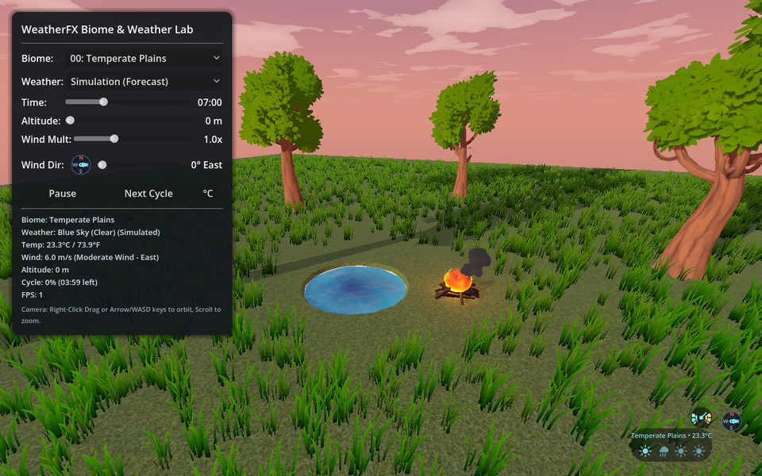

# Weather FX for Godot 4.8+

A high-performance, modular climate, weather, and atmospheric wind simulation system for Godot 4.8+. Features 20 universal biomes, altitude- and time-based temperature lapse curves, procedural 4-minute forecasting cycles, rain ground impact effects (puddle ripples & splash droplets), global wind shader integration with stylized foliage sway, interactive Zelda-inspired HUD widgets, and a comprehensive test lab (`demo.tscn`).

> [!NOTE]
> **Plugin Activation vs Direct Scene Usage**:
> All core scripts register global class names with editor icons (`WeatherFX`, `PrecipitationFX`, `WeatherAudio`, `WeatherZone`, `WeatherForecastDisplay`, `TemperatureGaugeDisplay`, `GaugeNeedle`, `WindDirectionDial`, `WindVFX`, `FallingLeaves`, `FireFX`, `GrassField`, `BurnableGrass`, `FireTrailNode`, `ClimateData`, `WaterRipples`), so they appear in the *Create New Node* dialog whether or not the plugin is enabled.
> - **Direct Usage**: Instance `scenes/weather_fx.tscn` (or add a `WeatherFX` node) and control it via GDScript immediately. Ensure the global shader parameters are added under **Project Settings > Shader Globals**.
> - **Enabling the Plugin**: Enabling `Weather FX` in **Project Settings > Plugins** registers all required **Shader Globals** in `ProjectSettings` automatically.

---

## Interactive Demo Scene

Open and run **`res://addons/weather_fx/scenes/demo/demo.tscn`** to explore the complete feature suite in real time:

- **20 Biome Explorer**: Instantly travel between all 20 biomes from a dropdown menu.
- **Weather Simulation & Overrides**: Force or procedurally simulate Blue Sky, Cloudy, Rain, Heavy Rain, Storm, Snow, or Heavy Snow.
- **Interactive 360° Wind Direction Dial**: Click and drag the circular compass dial on the HUD to rotate the global wind vector in real time.
- **Wind Multiplier Scrubber**: Adjust wind power from `0.0x` (calm) to `3.0x` (gale force) to test foliage sway and particle velocities.
- **Rain Impact Physics**: Observe raindrops bursting into upward water splashes and concentric expanding puddle ripples on ground contact.
- **Time-of-Day Scrubber**: Scrub time from 0:00 to 24:00 to test diurnal temperature swings, sunrise/sunset lighting, and day/night transitions.
- **Altitude Scrubber**: Test temperature lapse rate as altitude climbs from 0m to 1500m.
- **Unit Toggle**: Instantly switch between Celsius (`°C`) and Fahrenheit (`°F`) across all HUD displays and gauges.
- **Diagnostic Info & FPS Counter**: HUD readout (refreshed by a `StatusTimer`) of FPS, current temperature, active biome, wind speed & cardinal direction, altitude, and cycle countdown.
- **Free Camera Orbit**: Right-click drag or WASD/Arrow keys to orbit around the scene and zoom in/out with the mouse scroll wheel.

All demo UI and `WeatherFX` signal connections are wired in `demo.tscn`; `demo.gd` only holds the handlers.

---

## Core Features

### 1. 20 Universal Biomes
Provides statistical weather distribution tables, diurnal temperature ranges, altitude lapse rates, and baseline wind power across 20 distinct biomes (`ClimateData.BIOME_DEFINITIONS`):
- `TEMPERATE_PLAINS` (0), `NORTHERN_PLAINS` (1), `ARCTIC_TUNDRA` (2), `ARID_CANYON` (3), `ALPINE_PEAKS` (4)
- `DESERT_DUNES` (5), `DESERT_PLATEAU` (6), `VOLCANIC_FOOTHILLS` (7), `AUTUMN_HIGHLANDS` (8), `WETLANDS_VALLEY` (9)
- `COASTAL_PLAINS` (10), `TROPICAL_RAINFOREST` (11), `HUMID_COAST` (12), `VOLCANIC_CRATER` (13), `VOLCANIC_CALDERA` (14)
- `SHADOW_WOODS` (15), `MISTY_WOODS` (16), `DESERT_GLACIER` (17), `ANCIENT_FOREST` (18), `DEEP_DESERT` (19)

### 2. Signal-Driven Architecture
`WeatherFX` is the single simulation source. Everything else subscribes to its signals and caches the values it needs; per-frame work is reserved for continuous animation (particle drift, creeper advance, needle lerp).

- **The `"WeatherFX"` group**: every `WeatherFX` node adds itself to the `WeatherFX` group when it enters the tree. Consumers expose `@export var weather_fx: WeatherFX`; when it is left unassigned they fall back to `get_tree().get_first_node_in_group("WeatherFX")` in `_ready()`, so a single `WeatherFX` in the scene needs no manual wiring.
- **Child nodes of `weather_fx.tscn`** (each has `weather_fx` pointing at the parent):
  - `PrecipitationFX` (Node3D): rain, splash and snow `GPUParticles3D`; reacts to `weather_changed`, `wind_changed`, `playback_changed`; follows `weather_fx.target_node`; on Forward+/Mobile the rain collides with the `RainGround` heightfield (`GPUParticlesCollisionHeightField3D` following the target, 56 m wide, 512 resolution, always updated) and every splash/ripple is sub-emitted where its drop lands, so they sit on ramps, roofs and grass; the Compatibility renderer has no particle collision, so there the splash emitter is a plane on the ground found under the target.
  - `WeatherAudio` (Node): weather SFX players (`audio_rain_light`, `audio_rain_heavy`, `audio_storm`, `audio_wind`) and six optional background-ambience (`bgs_*`) slots. BGS is re-evaluated only on `weather_changed`, `daylight_changed` and `playback_changed`; a player that stays the target is never restarted.
  - `WindVFX` (Node3D): wind ribbons, leaf streams (`airflow_particles` / `leaf_particles` arrays) and gust sweeps driven by `GustTimer` / `TreeCheckTimer` Timer nodes. Leaves only appear in tree biomes and, with `require_nearby_trees`, when a node in the `Tree`, `Trees`, `Foliage` or `Choppable` group is within `tree_detection_radius` (the addon's `tree_*.tscn` scenes are in `Tree`).
  - `CycleTimer` (Timer): drives `advance_cycle()`; `get_cycle_progress()` reads it.
- **Other consumers**: `FallingLeaves`, `FireFX`, `GrassField`, `BurnableGrass`, `FireTrailNode`, `WeatherZone`, `WeatherForecastDisplay`, `TemperatureGaugeDisplay` and `WindDirectionDial` all follow the same `weather_fx` export + group fallback pattern.

### 3. Atmospheric Wind & Foliage System
- **Global Shader Uniforms** (written by `WeatherFX`):
  - `weather_wind_strength` (`float`), `weather_wind_direction` (`vec3`), `weather_precipitation_strength` (`float`, `0.0` to `1.2`)
  - `weather_foliage_tint` / `weather_grass_tint` (`color`): biome tints blended over `biome_tint_transition_speed`.
- **Stylized Wind Shaders** (`resources/`): `grass_wind.gdshader` (multi-octave sway, vertical color gradient, wetness, and combustion driven by `burn_progress`, the `instance_burn_progress` instance uniform, or per-blade MultiMesh custom data against `fire_clock`), `foliage_wind.gdshader` (trunk lean, branch sway, leaf flutter), `pond_water.gdshader` (see below).
- **Instanced Grass Generator (`GrassField`)**: `MultiMeshInstance3D` field using the preloaded Quaternius grass meshes (`Common Short`, `Common Tall`, `Wispy Short`, `Wispy Tall`) or a custom mesh, with circular exclusion zones.

### 4. Rain Ground Impact Effects (Splashes & Ripples)
- Falling raindrops spawn a sub-emitter at ground impact (disabled automatically on Web / Compatibility renderers).
- Draw pass 1: droplet splashes; draw pass 2: expanding puddle ripples, kept on the node but switched off (`draw_passes = 1`) because rings on every surface were too much; set `draw_passes` back to 2 on `RainSplashParticles` to bring them back. Ripples on water come from the pond shader's `rain_ripples`, driven by `weather_precipitation_strength`, and are unaffected.
- Placement: each drop stops on the `RainGround` heightfield (rigid collision, no bounce; a hidden drop would not sub-emit) and sub-emits its splash there (`SUB_EMITTER_AT_COLLISION`), so ripples follow the real surface under every drop instead of one plane at the target's feet. The splash emitter has to keep emitting for sub-emission to work, so it is parked 500 m below the target with a tall visibility box; its own particles are never seen. The heightfield is 56 m wide and 40 m tall around the target; lower its `resolution` if the extra depth pass costs too much.

### 5. Interactive Zelda-Inspired HUD Widgets
Instance the widget scenes (they carry their layout, `StyleBox` and shader material) and assign `weather_fx`, or rely on the group fallback:
- **`scenes/weather_forecast_display.tscn`** (`WeatherForecastDisplay`, PanelContainer): pill-shaped forecast strip with SVG icons. The strip scrolls with a `Tween` synchronized to the cycle timer (restarted on `forecast_updated` / `playback_changed`).
- **`scenes/temperature_gauge_display.tscn`** (`TemperatureGaugeDisplay`, Control with `mouse_filter = Ignore`): circular segmented thermometer (`temperature_gauge.gdshader`) with a `GaugeNeedle` child (`%GaugeNeedle`).
- **`WindDirectionDial`** (Control, drawn in code): interactive 360° compass with cardinal points and click-drag vector rotation.
- Shared pill style: `resources/hud_panel_style.tres`.

### 6. Temperature Curves, Lapse Rates & Freezing Transitions
- Smooth altitude lapse (0m–1500m+) and a diurnal solar curve.
- Precipitation generated at or below 0°C becomes **Snow** / **Heavy Snow**; rare sun-showers during daylight.

### 7. Procedural Forecasting Queue
- Generates a queue of upcoming weather conditions (default 7 cycles ahead).
- `CycleTimer` advances it every `cycle_duration_seconds` (default 240) or manually via `advance_cycle()`.

### 8. BotW-Style Wildfire & Thermal Updrafts
Fully self-contained within the addon:

- **`GrassField` creeping wildfire**: `ignite_at(world_pos, radius, duration)` lights the grass cells around the point and the front then grows as a cellular fire on the field's origin grid (`BUCKET_SIZE`, 2 m cells): every lit cell passes the fire to its eight neighbours after a delay set by the creep speed (clamped to the BotW **1.2–1.8 m/s** band, `fire_spread_speed`) and the wind, which only slows the front across and against it (`UPWIND_SPEED_FACTOR`), so the fire spreads as a ragged ring leaning downwind rather than a line. Cells with no grass (exclusion zones, bare ground) never catch, a flame more than `IGNITE_HEIGHT` (1 m) above or below the blades lights nothing (a torch on a platform over the grass), the front stops growing after `duration`, lit cells flame for `CELL_BURN_SECONDS` and stay ash for good, and a `FireTrailNode` sits on each lit cell while the `MAX_TRAIL_NODES` budget allows. The blades themselves burn through the grass shader: each blade's MultiMesh custom data records when it caught (plus a jitter) and the shader reads that against the material's `fire_clock`, so embers travel down the blade, it chars and collapses to ash, and the field owns a runtime copy of the material for its clock. Wind and rain come from `wind_changed` / `weather_changed`; rain douses the front, chars whatever was lit, and nothing catches while it rains. `douse_at(world_pos, radius)` puts out just the cells and flames within reach (a water spell) and leaves the rest of the front burning.
- **`FireTrailNode` life cycle**: a `Tween` runs grow (0.8s) → peak flicker (2.8s) → decay (1.4s) → `extinguish()`; the updraft area leaves the `Updraft`/`Thermal` groups on burnout (no ghost lift).
- **`BurnableGrass` interactive patches** (`scenes/burnable_grass.tscn`): ignite via the scene-wired `HitboxArea` (`area_entered` from any `Fire`-group area) or the `ignite_action` input (`&"action"` by default, ignored when the action is not in the `InputMap`) while the player stands in the hitbox. `BurnTimer` / `SpreadTimer` drive burnout and downwind spreading; ignition is refused while it rains. Delegates field-wide creeping to any overlapping `GrassField`.
- **Thermal updrafts**: every burning node registers a vertical `Area3D` cylinder (20 m tall; 2 m radius for `FireTrailNode`, 4.5 m for `BurnableGrass`; groups `Updraft` + `Thermal`) that paragliders can catch for lift.
- **Proximity VFX culling**: updraft wind streaks only render while the player (via the `Player` group, `class_name` fallback, camera fallback) is within 5m.
- **Shared wind spread math**: `WeatherFX.get_wind_spread_factor()` (downwind boost, capped; upwind suppression).

### 10. Thunderstorm Lightning (`scripts/lightning_fx.gd`)
`LightningFX` sits under the WeatherFX node in `weather_fx.tscn`. While `active_weather` is `STORM` (and the weather is simulating) it rolls a strike every `strike_interval` seconds, `strike_distance` metres from `target_node` in a random direction, on the ground found by a ray. A strike is a `LightningBolt` (`scenes/lightning_bolt.tscn`): a jagged additive ribbon redrawn with fresh jitter every frame for `life` seconds so it crackles, an `OmniLight3D` flash that fades with it, and thunder from the vendored Gravity Sound pack (`thunder strike`, `heavy thunder 1/2`, `distant thunder 1`) that plays after the sound has travelled from the foot to the camera at `speed_of_sound`, so a far strike flashes first and rumbles later. Under the foot, anything within `damage_radius` with a `take_hit(damage, from)` method takes `damage` (physics shape query, duck-typed, so the addon stays independent of the player controller), and the grass within `ignite_radius` catches through the `GrassField` and `BurnableGrass` groups, as a wildfire would. A storm always rains and rain otherwise keeps grass from catching, so the strike passes `force` to `ignite_at` and `ignite`: a bolt is hot enough for wet grass, and the fire then burns until the next weather change douses it. Random strikes roll on the multiplayer authority and `strike_at` replicates as an RPC, so every peer sees the same bolt. The same node is an API for the game: `strike_at(position, hit_damage)` calls a sky bolt onto a point (0 damage for a purely visual one, negative for the storm's own), `arc(from, to)` draws a silent bolt between two points, `bodies_near(position, radius)` lists what a strike would hit, and `struck(position)` fires for each strike. The player controller demo's Lightning and Chain Lightning spells draw with these, so the storm and the spells share one lightning.

### 9. Interactive Pond Water (`resources/pond_water.gdshader`)
Toon-banded pond surface with real wind waves, contact/edge foam, and scattered rain impact ripples (hashed per cell and staggered in time, so they never form a grid). The wind waves are a sum of six Gerstner (trochoidal) waves fanned around the wind direction, a fixed table in the shader (`WAVES`: angle from the wind, wave number as a multiple of `wave_frequency`, share of `wave_amplitude`; the shares sum to 1 so the tallest crest never exceeds the active amplitude): each wave moves the water sideways toward its crest as well as up, which pinches the crests sharp and leaves the troughs broad, the vertex normal is the cross product of the displaced surface's tangents, and the Jacobian of the displacement is passed to the fragment stage so the most pinched crests foam (`crest_foam`) and brighten toward the shallow colour (`crest_light`), the way [GodotOceanWaves](https://github.com/2Retr0/GodotOceanWaves) (MIT) foams the peaks of its FFT surface; a pond only needs a handful of waves instead of an FFT. `wave_steepness` (0-1) sets how far the crests pinch before they would loop over, `wave_speed` is a tempo on the deep-water dispersion (1 is physical: longer waves travel faster), and the wind strength scales amplitude and tempo. Gameplay code that needs the surface height mirrors the table and undoes the sideways travel with a few fixed-point steps (see `Buoyancy.get_wave_displacement` in the player controller demo).  Bodies in the water ripple it for real through the `WaterRipples` node (`scenes/water_ripples.tscn`): wire the water `Area3D`'s `body_entered` / `body_exited` to its `_on_body_entered` / `_on_body_exited` and point `water_mesh` at the surface. Every body in the water has its meshes put on visual layer 10; an orthographic `MaskCamera` sits `depth_below` under the surface looking straight up, rendering only that layer up to `depth_above` over the water line, so its `MaskViewport` holds the underside outline of everything in the water (from above, the near plane would slice the tops off the bodies and leave only culled back faces). The `SimulationViewport` runs a height-field wave simulation at `texels_per_metre` (default 32, 3 cm texels; `resources/water_ripples_sim.gdshader`, a never-cleared viewport that reads its own last frame through a `BackBufferCopy`; R = height, G = previous height, B = last footprint, alpha unused because the render target does not return it reliably): the footprint is softened by `mask_blur` texels so it never reads as pixels, the surface under a body settles into a hollow of the footprint's shape (`sink`, `sink_rate`), wherever the footprint changed since the last frame the water is pushed (`push`, up where a body arrives, down where it leaves), and the wave equation (`wave_speed`, `damping`) carries it out, so a moving body throws a bow wave ahead and a wake behind on its own. A hull leaves a hull-shaped wake and bow wave, a bobbing float leaves rings, a swimmer's strokes leave the shape of the strokes, and a body sitting still leaves nothing. The node fills the surface material's `ripple_texture`, `ripple_area` (world X, Z, width, depth) and `ripple_height` (m per simulated unit, default 4 cm) uniforms on ready; the shader displaces the vertices by that height in `vertex()` and lights the fragments by its slope, tilts the surface normal by the slope (`ripple_shading` exaggerates it for the toon look), brightens crests toward the shallow colour (`ripple_crest_light`) and foams only the tallest crests; nothing is drawn around a body's outline. Subdivide the water mesh to roughly 10-15 cm cells so the geometry can carry the waves. A surface without a `WaterRipples` node (zero `ripple_area`) is unaffected. `edge_foam_width` (0 disables the radial rim band, leaving the contact foam to find the walls of a rectangular pool), `depth_foam_distance` and `foam_softness` size the rim and contact foam. The surface reads the stencil buffer (`stencil_mode read, compare_not_equal, 1`), so any mesh drawn with a stencil-writing mask (a boat hull) cuts a hole in the water; the vertex waves are a plain function of position, TIME, the wave uniforms and the wind globals, so gameplay code can mirror them for buoyancy. The drawn caustic web of earlier versions is gone: the crests carry the light themselves.

### 11. Sky Clouds (`scripts/weather_clouds.gd`) and the Binbun sky
`WeatherClouds` drives a Binbun sky shader from the weather. The skies in `assets/BinbunSky/skies/` (basic, stylized and experimental variants of Godot Skies by Binbun) are `Sky` resources whose `ShaderMaterial` reads the scene's directional light for its own day, sunset and night colours and scrolls two layers of noise cloud, so they run the same on every renderer, the web export included, where compositor effects and volumetric fog do not (the addon's copy of Binbun's `main.gdshader` fixes two `clamp()` calls whose arguments were in the wrong order, `clamp(0.0, 1.0, x)`: undefined in GLSL, it happened to work on Vulkan and turned the whole sky white on the Compatibility renderer and WebGL). `WeatherFX.fog_sky_affect` (0.3) keeps the weather's fog from painting the sky flat: at Godot's default of 1 any fog at all (cloudy, rain, snow, storm) replaces the sky with the fog colour, clouds and all. `WeatherClouds` sets that material's `cloud_density`, `cloud_color` and `wind_speed`: a thin bright scatter in blue sky (`clear_density`, `clear_color`), a grey sheet when cloudy (`cloudy_density`, `cloudy_color`) and a dark one in rain, snow and storms (`rain_density`, `rain_color`), eased over `transition_seconds` so a change rolls in rather than snaps; it only processes while the sky is on its way somewhere and stops once every value has settled. The clouds scroll down the wind at `wind_scroll_scale` per unit of the weather's wind strength and never slower than `wind_min_scroll`. With `night_sun` set the clouds dim as the sun sets: the colour is scaled down to `night_dim` with the sun below the horizon, kept at full brightness above `night_dusk_height` (the sun's height, 1 = overhead) and eased between, retargeting on every `time_changed` tick of the weather's clock. It works on a copy of the sky and its material, so the asset on disk is never edited, and a `WorldEnvironment` whose sky is not a Binbun one is left alone.

Wiring: a `WorldEnvironment` with one of the Binbun skies as its `Environment.sky`, the `WeatherFX` node, and a `Node` carrying `weather_clouds.gd` with `world_environment` -> that `WorldEnvironment`, `weather` -> the `WeatherFX` node and `night_sun` -> your `DirectionalLight3D` (leave it empty for no dimming). `demo.tscn` does exactly this.

---

## How to Use

### Nodes to add and where

| Node | Where it goes | Set in the Inspector |
|---|---|---|
| `WeatherFX` (instance `scenes/weather_fx.tscn`) | Once per level, as a child of the level root | `sun_light` -> your `DirectionalLight3D`; `world_environment` -> your `WorldEnvironment`; `target_node` -> the node the rain and snow follow (usually the player); `date_and_time_node` -> a clock node with a `time_changed(hours)` signal (the Date and Time addon's `DateAndTime`), or leave it empty and drive `manual_time_of_day`; `current_biome`, `force_weather` / `manual_weather`, `wind_direction`, `wind_strength_multiplier` |
| `WeatherAudio` (inside `weather_fx.tscn`) | Nothing to add | Optional `bgs_day_*` / `bgs_night_*` exports -> your ambience `AudioStreamPlayer`s (`scenes/bgs.tscn` ships a set) |
| `GrassField` (instance `scenes/grass_field.tscn`) | Under your scenery, at the centre of the field | `instance_count`, `field_size`, `min_scale` / `max_scale`, `exclusion_radius`; `weather_fx` and `enable_wildfire` for fire |
| `tree_1.tscn` .. `tree_5.tscn` | Anywhere; each carries its wind-shader mesh and a `FallingLeaves` emitter | Nothing required; the `Tree` group is set in the scene |
| `FireFX` (`assets/models/loop_box/Scenes/Fire.tscn`, or the script on your own fire) | On a campfire or torch | `smoke_particles`, `spark_particles`, `fire_light` -> its own children; `weather_fx` optional |
| `WeatherForecastDisplay`, `TemperatureGaugeDisplay` (instance their scenes), `WindDirectionDial` (script on a `Control`) | Under your HUD `CanvasLayer` | `weather_fx` -> the WeatherFX node |
| Pond water: a `MeshInstance3D` with `resources/pond_water_material.tres` | Sunk into a hole in the ground | Subdivide the mesh to 10-15 cm cells. For wakes and rings, add `scenes/water_ripples.tscn` next to it, set `water_mesh`, and wire the water `Area3D`'s `body_entered` / `body_exited` to its `_on_body_entered` / `_on_body_exited` |
| `WeatherClouds` (`scripts/weather_clouds.gd` on a `Node`) | Once per level, next to WeatherFX | `weather` -> the WeatherFX node; `world_environment` -> a `WorldEnvironment` whose `Environment.sky` is one of `assets/BinbunSky/skies/*/*.tres`; `night_sun` -> your `DirectionalLight3D`; `clear_` / `cloudy_` / `rain_` density and colour, `transition_seconds`, `wind_scroll_scale`, `wind_min_scroll`, `night_dim`, `night_dusk_height` |
| `WeatherZone` (script on an `Area3D`) | Around a region that should switch biome when entered | `biome`, `weather_fx` |
| `BurnableGrass`, `FireTrailNode` | Individual burnable props | See section 8 |

Minimum scene:

```text
Level (Node3D)
├── WorldEnvironment
├── DirectionalLight3D
├── DateAndTime                         (optional clock)
├── WeatherFX (weather_fx.tscn)         sun_light, world_environment, target_node, date_and_time_node
├── WeatherClouds (weather_clouds.gd)   weather, world_environment (Binbun sky), night_sun
└── HUD (CanvasLayer)
    ├── WeatherForecastDisplay          weather_fx
    └── TemperatureGaugeDisplay         weather_fx
```

Everything talks through exports and signals, so weather, wind, precipitation and the HUD run without a line of script. Enable the plugin once so the shader globals are registered (or add them by hand; see Global Shader Parameters).

### How `demo.tscn` does it

| Demo node | What it demonstrates |
|---|---|
| `WeatherFX` | `weather_fx.tscn` instanced with `sun_light`, `world_environment`, `target_node` (`DemonstrationTarget`) and `date_and_time_node` (`DateAndTime`) all set in the Inspector; `manual_time_of_day` matches the clock's 7:00 start. |
| `WeatherFX/WeatherAudio` | Its six `bgs_*` exports point at the players inside `BackGroundSounds` (`bgs.tscn`). |
| `WorldEnvironment`, `WeatherClouds` | The environment's sky is `assets/BinbunSky/skies/stylized/stylized_sky_01.tres`; `WeatherClouds` has `weather`, `world_environment` and `night_sun` (the `DirectionalLight3D`) set in the Inspector, so the sky's clouds thicken and darken with the weather, scroll with the wind and dim at night. |
| `DateAndTime` | A small `@tool` stand-in clock (`demo_date_and_time.gd`) with only `current_time` and `time_changed`, so the demo runs without the Date and Time addon. The real addon's `DateAndTime` node drops into the same slot. |
| `Ground/Water` | A `PlaneMesh` with `pond_water_material.tres` sitting in the `Ground/Hole` cut-out: wind waves, rain rings and edge foam with no extra nodes. No `WaterRipples` here because nothing enters the water. |
| `Scenery/GrassField` | 10 000 blades over 50 x 50 m with a 3 m exclusion around the campfire. |
| `Scenery/Fire` | A `FireFX` campfire; its smoke and sparks lean with the wind. |
| `Scenery/Tree1` .. `Tree5` | The five tree scenes; canopies sway and drop leaves with the wind and tint by biome. |
| `HUD/BottomRight/WeatherForecastDisplay`, `TemperatureGaugeDisplay`, `HUDWindDial` | The HUD widgets with `weather_fx` set in the Inspector. |
| `HUD/ControlPanel/...` | Sliders, dropdowns and buttons whose signals are connected in the scene to `demo.gd` handlers that set `current_biome`, `force_weather` / `manual_weather`, `manual_time_of_day`, `current_altitude`, `wind_strength_multiplier` and `wind_direction`; `AdvanceCycleButton.pressed` goes straight to `WeatherFX.advance_cycle`. |
| `WeatherFX` signals -> root | `biome_changed`, `weather_changed`, `temperature_changed` and `wind_changed` are connected in the scene to `_update_ui_state`, so the panel follows the simulation. |
| `StatusTimer` | Refreshes the readout once a second instead of every frame. |

---

## Scene Tree Architecture

```text
WeatherFXDemo (Node3D)
├── WorldEnvironment (Binbun sky: assets/BinbunSky/skies/stylized/stylized_sky_01.tres)
├── DirectionalLight3D (Sun/Moon Light, oriented by WeatherFX)
├── DemonstrationTarget (Node3D - target_node)
├── Ground (CSGBox3D)
│   ├── Hole (CSGCylinder3D, subtracted)
│   └── Water (MeshInstance3D - pond_water_material.tres)
├── Scenery (Node3D)
│   ├── GrassField (grass_field.tscn)
│   ├── Fire (FireFX campfire)
│   └── Tree1..5 (tree_*.tscn, group "Tree")
│       ├── Mesh (Bark & Foliage Wind Shaders)
│       └── FallingLeaves (falling_leaves.tscn)
├── CameraPivot / Camera3D
├── DateAndTime (demo clock; emits time_changed)
├── WeatherFX (weather_fx.tscn - group "WeatherFX")
│   ├── CycleTimer (Timer -> advance_cycle)
│   ├── PrecipitationFX
│   │   ├── RainParticles (sub-emitter -> RainSplashParticles)
│   │   ├── RainSplashParticles
│   │   └── SnowParticles
│   ├── WindVFX (wind_vfx.tscn: ribbons, leaves, GustTimer, TreeCheckTimer)
│   └── WeatherAudio
│       ├── RainLightSFX / RainHeavySFX / StormSFX / WindSFX
│       └── (bgs_* exports -> BackGroundSounds players in the demo)
├── WeatherClouds (weather_clouds.gd - drives the Binbun sky's clouds from WeatherFX)
├── BackGroundSounds (bgs.tscn - day/night ambience players)
├── StatusTimer (Timer -> status readout)
└── HUD (CanvasLayer)
    ├── ControlPanel (biome, weather, time, altitude, wind controls)
    └── BottomRight
        ├── WeatherForecastDisplay (weather_forecast_display.tscn)
        ├── TemperatureGaugeDisplay (temperature_gauge_display.tscn)
        └── HUDWindDial (WindDirectionDial)
```

---

## GDScript API Reference

### Signals

| Signal | Emitted when |
| --- | --- |
| `weather_changed(new_weather, old_weather)` | the active `ClimateData.WeatherType` changes |
| `forecast_updated(forecast: Array[ClimateData.WeatherType])` | the queue is regenerated or advanced |
| `cycle_advanced(current_weather)` | `advance_cycle()` runs |
| `biome_changed(new_biome, old_biome)` | `current_biome` changes |
| `temperature_changed(temp_celsius)` | time, altitude or biome moves the temperature |
| `wind_changed(strength, direction)` | wind strength/direction, weather multiplier or playback changes |
| `daylight_changed(is_day)` | the clock crosses 06:00 / 18:00 |
| `playback_changed(active)` | the simulation starts or stops ticking (`is_playing`, editor toggle) |

### Consumer Pattern

```gdscript
extends GPUParticles3D

@export var weather_fx: WeatherFX # assign in the scene, or leave empty for the group fallback

func _ready() -> void:
    if weather_fx == null:
        weather_fx = get_tree().get_first_node_in_group(&"WeatherFX") as WeatherFX
    if is_instance_valid(weather_fx):
        weather_fx.wind_changed.connect(_on_wind_changed)
        _on_wind_changed(weather_fx.current_wind_strength, weather_fx.wind_direction)

func _on_wind_changed(strength: float, direction: Vector3) -> void:
    emitting = strength > 4.0 # cache what you need; animate in _process from the cached values
```

### Controlling Weather & Wind

```gdscript
weather.current_biome = ClimateData.BiomeZone.ARCTIC_TUNDRA   # switch biome
weather.set_weather(ClimateData.WeatherType.RAIN)              # force weather (force_weather + manual_weather)
weather.resume_forecast()                                      # back to the procedural forecast
weather.wind_direction = Vector3(0.0, 0.0, -1.0)               # blow North (-Z)
weather.wind_strength_multiplier = 1.5
weather.advance_cycle()                                        # next forecast cycle now
weather.is_playing = false                                     # pause cycle, VFX and audio
var progress: float = weather.get_cycle_progress()             # 0.0 .. 1.0 of the current cycle
var queue: Array[ClimateData.WeatherType] = weather.get_forecast()
var hours: float = weather.get_current_time_hours()            # from date_and_time_node or manual_time_of_day
```

`date_and_time_node` accepts any node exposing `current_time` (hours) and a `time_changed(float)` signal, such as the `DateAndTime` addon; `manual_time_of_day` is the fallback.

### Static Helper Methods

For scripts that cannot hold a node reference (e.g. other addons), the last simulated values are mirrored in statics. Addon scripts subscribe to the signals above instead of polling these.

```gdscript
var wind_spd: float = WeatherFX.get_wind_strength()
var wind_dir: Vector3 = WeatherFX.get_wind_direction()
var wetness: float = WeatherFX.get_precipitation_strength()
var factor: float = WeatherFX.get_wind_spread_factor(wind_alignment, wind_spd)
var is_player: bool = WeatherFX.is_player_node(body)   # "Player" group, then `class_name Player`
var player: Node3D = WeatherFX.find_player(get_tree())

var temp_f: float = ClimateData.celsius_to_fahrenheit(20.0)
var icon: Texture2D = ClimateData.get_weather_icon(ClimateData.WeatherType.STORM)   # preloaded SVG
var wet: float = ClimateData.get_precipitation_strength(ClimateData.WeatherType.RAIN) # 0.5
```

---

## Global Shader Parameters

```gdshader
shader_type spatial;

global uniform float weather_wind_strength;
global uniform vec3 weather_wind_direction;
global uniform float weather_precipitation_strength;

void vertex() {
    vec3 wind_displacement = weather_wind_direction * weather_wind_strength * 0.05 * VERTEX.y;
    VERTEX += (inverse(MODEL_MATRIX) * vec4(wind_displacement, 0.0)).xyz;
}

void fragment() {
    float wetness = clamp(weather_precipitation_strength, 0.0, 1.0);
    ALBEDO *= (1.0 - wetness * 0.25);
    ROUGHNESS = mix(ROUGHNESS, 0.1, wetness);
    SPECULAR = mix(SPECULAR, 0.8, wetness);
}
```

---

## Tests

```powershell
& 'C:\Godot\godot.exe' --headless --path . -s addons/gut/gut_cmdln.gd -gdir=res://addons/weather_fx/tests -gexit
```

---

## Credits & Attributions

- **Quaternius** – *Stylized Nature Megakit* ([quaternius.com](https://quaternius.com/), CC0) — tree and grass models, bark and foliage textures (`assets/models/quaternius/`).
- **BinbunVFX** – *Fire Effects Pack* ([binbunvfx.itch.io](https://binbunvfx.itch.io/)) — the billboard flame shader in `assets/vfx/fire/flame_01.gdshader` is adapted from this pack.
- **TomMusic** – *Fantasy SFX* ([tommusic.itch.io](https://tommusic.itch.io/)) — torch/fire crackle loop in `assets/audio/tommusic/sfx/Torch/`.
- **Gravity Sound** – *Weather Sound Pack* ([gravity-sound.itch.io](https://gravity-sound.itch.io/)) — rain, thunder and wind ambience (`assets/audio/gravitysound/`).
- **Binbun (Binbun3D)** - *Godot Skies* ([binbun3d.itch.io/godot-skies](https://binbun3d.itch.io/godot-skies)) - the sky shader, sky materials and cloud noise textures in `assets/BinbunSky/` (the folder has a `.url` to its page). License not recorded - fill in.
- **ambientCG** – *Grass 004* ([ambientcg.com/view?id=Grass004](https://ambientcg.com/view?id=Grass004), CC0) — `assets/textures/Grass004_1K-JPG_Color.jpg` ground texture.
- **Godot Shaders** – *Stylized BOTW Fire* ([godotshaders.com/shader/stylized-botw-fire](https://godotshaders.com/shader/stylized-botw-fire/)) and *Stylized Smoke Shader* ([godotshaders.com/shader/stylized-smoke-shader](https://godotshaders.com/shader/stylized-smoke-shader/)) — shaders, meshes, and textures in `assets/models/loop_box/`. License not recorded — fill in.
- **`assets/vfx/wind/`** (wind ribbon/streak VFX scenes, meshes, shaders, and textures) — source/license not recorded — fill in.
- **`assets/audio/tommusic/bgs/`** (Forest Day / Forest Night ambient loops) — source/license not recorded — fill in. Re-encoded to 96 kbps Vorbis (from about 500 kbps) so a web export stays small, and imported with `loop` on, as `WeatherAudio` never restarts them; the heavier gravitysound rain and wind loops were re-encoded the same way.

---

## License

This project is licensed under the [MIT License](LICENSE).
